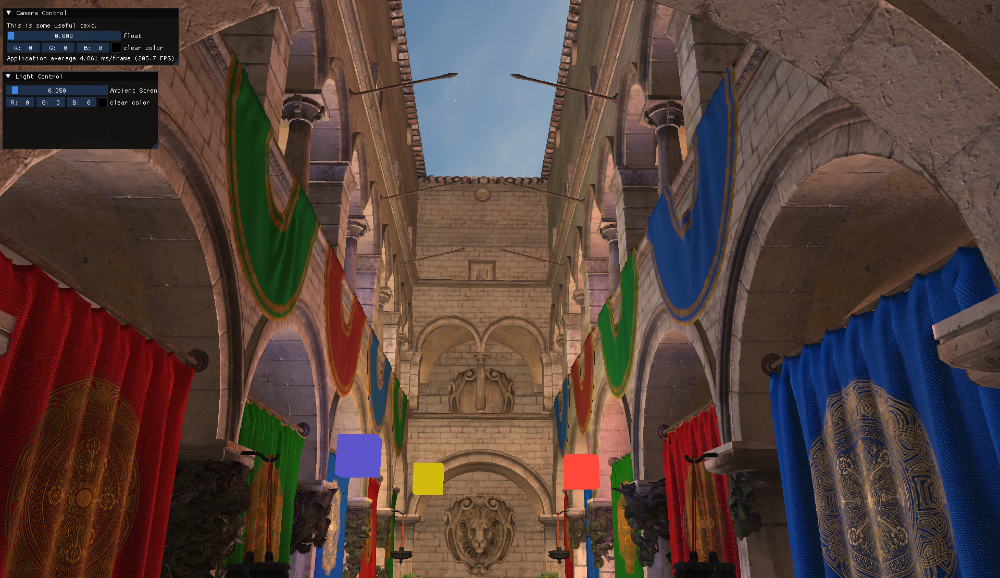

# 3D Engine

## Current Status





- Blinn Phong Lighting
- Multiple Lights
- Normal mapping
- ImGui Integration

## How to Build

```sh
cmake -B build
cmake --build build -j($nproc)
```

## Libraries Used

- [glad](https://github.com/Dav1dde/glad)
- [stb](https://github.com/nothings/stb)
- [assimp](https://github.com/assimp/assimp)
- [GLFW](https://github.com/glfw/glfw/)
- [GLM](https://github.com/g-truc/glm)
- [ImGui](https://github.com/ocornut/imgui/)